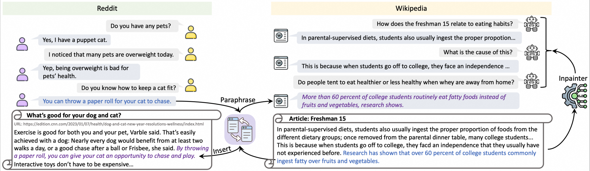

# Causal Document Grounded Dialogue Pretraining

## Overview
The goal of **document-grounded dialogue** (DocGD) is to generate a response by anchoring the evidence in a supporting document in accordance with the dialogue context. This entails four causally interconnected variables. While task-specific pre-training has significantly enhanced performances on numerous downstream r tasks, existing DocGD methods still rely on general pre-trained language models without a specifically tailored pre-training approach that explicitly captures the causal relationships. 

To address this, we present the first causallycomplete dataset construction strategy for developing million-scale DocGD pre-training corpora. Additionally, we propose a causally-perturbed pre-training strategy to better capture causality by introducing perturbations on the variables and optimizing the overall causal effect. Experiments conducted on three benchmark datasets demonstrate that our causal pretraining yields substantial and consistent improvements in fully-supervised, low-resource, few-shot, and zero-shot settings.


## Pre-Training
Prepare the environment by running ``pip install -r requirements.txt``. Download the dataset from [Dataset](https://huggingface.co/datasets/Niesheng/CausalDD) and prepare it under the DATA folder. Run the following command ``bash scripts/pretrain.sh`` for pretraining.

## Finetuning
We follow the process described in [UniGDD](https://github.com/gao-xiao-bai/UniGDD) for finetuning based on the pretrained checkpoint as the initialization, and evaluate the performances for both knowledge identification and response generation tasks following UniGDD.


## Citation 
If you finding our work interesting or helpful to you, please cite this repository:
```  
@article{zhao2023causal,
  title={Causal Document-Grounded Dialogue Pre-training},
  author={Zhao, Yingxiu and Yu, Bowen and Yu, Haiyang and Li, Bowen and Wang, Chao and Huang, Fei and Li, Yongbin and Zhang, Nevin L},
  journal={EMNLP},
  year={2023}
}